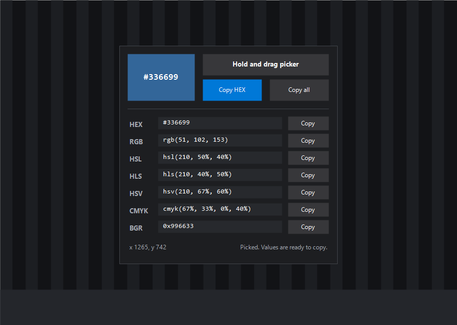

#  color-picker

Drag over anything on screen and copy its colour as HEX, RGB, HSL and more

Windows

<!-- media: hero -->
<!--  -->
<!-- /media: hero -->

## What it is

A little colour picker in the style of Pixie. You hold the picker button and drag
over the screen, and the window updates live with the colour under your cursor.

When you let go of the mouse the value freezes, which makes copying it a lot less
fiddly. It shows HEX, RGB, HSL, HLS, HSV, CMYK and BGR.

## Get it

Paste this into your AI coding agent (Claude Code, Codex, Cursor...):

> Clone https://github.com/mikecann/color-picker and make it my own. It's one of Mike
> Cann's personal tools, so read the README first, change anything specific to his
> setup to suit mine, then help me get it running.

### Or set it up by hand

You'll need Windows with Windows PowerShell 5.1, Windows Script Host enabled,
and Git to clone the repo. There are no external dependencies or API keys,
so you don't need a `.env` file.

```powershell
git clone https://github.com/mikecann/color-picker.git
cd color-picker
powershell -NoProfile -ExecutionPolicy Bypass -File .\install.ps1
```

The installer puts thin launchers in `C:\dev\tools` and offers to add that folder
to your user PATH if needed. It creates **Color Picker**, **Pixie** and **picker**
shortcuts in your Start menu. Choose a different launcher folder with
`-ToolsDir "C:\my-tools"`, or use `-SkipPathCheck` to manage PATH yourself.
Right-click `Color Picker.lnk` in the launcher folder to pin it to the taskbar.

Keep the clone where you installed it. The launchers point at its files, so
`git pull` updates the tool without reinstalling. If you move the clone, run
the installer again from its new location.

## Using it

Open a new terminal and run:

```powershell
color-picker
```

Or search for **Color Picker** in Windows Search. To run from the clone directly:

```powershell
wscript.exe .\color-picker.vbs
```

Hold **Hold and drag picker**, drag over the colour you want, then release the
mouse to freeze it. Use **Copy HEX**, a row's **Copy** button, or **Copy all**.
Press **Escape** to stop picking, or to close the window when you're not picking.

## Screenshot



## Formats

| Format | Example |
|---|---|
| HEX | `#336699` |
| RGB | `rgb(51, 102, 153)` |
| HSL | `hsl(210, 50%, 40%)` |
| HLS | `hls(210, 40%, 50%)` |
| HSV | `hsv(210, 67%, 60%)` |
| CMYK | `cmyk(67%, 33%, 0%, 40%)` |
| BGR | `0x996633` |

## Tests

From the repo root:

```powershell
powershell -NoProfile -ExecutionPolicy Bypass -File .\tests\check-syntax.ps1
powershell -NoProfile -ExecutionPolicy Bypass -File .\tests\test_color_picker_core.ps1
powershell -NoProfile -ExecutionPolicy Bypass -File .\tests\test_install.ps1
powershell -NoProfile -ExecutionPolicy Bypass -File .\color-picker.ps1 -SelfTest
powershell -NoProfile -ExecutionPolicy Bypass -File .\color-picker.ps1 -SmokeTest
wscript.exe .\color-picker.vbs -SelfTest
```

The syntax, core and mocked installer tests also run with `pwsh` on macOS.
The GUI, native sampling and VBS launcher checks need Windows. CI runs the
syntax, core, mocked installer and native self-tests on Windows.

## Notes and troubleshooting

- It uses built-in .NET WinForms plus Win32/GDI pixel sampling.
- The VBS launcher starts it silently, so shortcuts do not flash a console window.
- If the command isn't found, open a new terminal and check the launcher folder
  is on PATH. The Start menu shortcuts work without PATH.
- If nothing opens, run the script in a terminal to see the error:

```powershell
powershell -NoProfile -ExecutionPolicy Bypass -File .\color-picker.ps1
```

The silent launcher needs Windows Script Host enabled.

## Uninstall

```powershell
powershell -NoProfile -ExecutionPolicy Bypass -File .\uninstall.ps1
```

If you installed with `-ToolsDir`, pass the same folder here. Uninstall removes
launchers and shortcuts that still point at this clone. It keeps the clone,
other tools and the shared launcher folder's PATH entry. Unpin the taskbar
shortcut yourself if you pinned it.

## More tools

You can find my other tools at [mikerosoft.app](https://mikerosoft.app).

MIT licensed.
